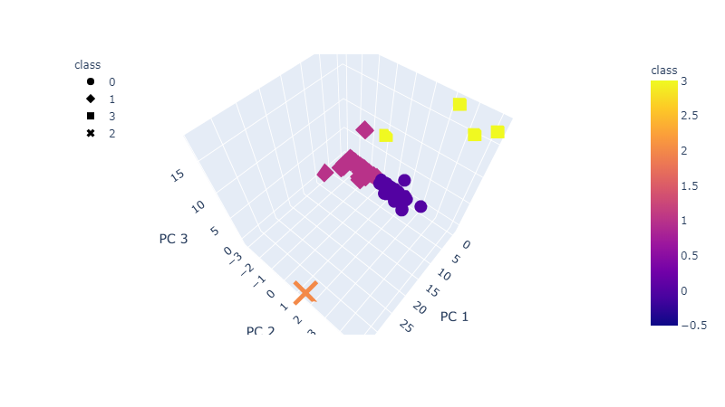

# Cryptocurrencies Analysis

## Overview

The following analysis was made with the purpose of analyzing and correctly categorizing the types of available cryptocurrency to trade. We cleaned the data and performed unsupervised machine learning (*KMeans algorithm*) to understand which clusters were most prominent across 3 comprehensive characteristics. The most efficient number of clusters for our data, per the [elbow curve](imgs/elbowcurve.png). Our final result can be easily visualized three-dimensionally.

